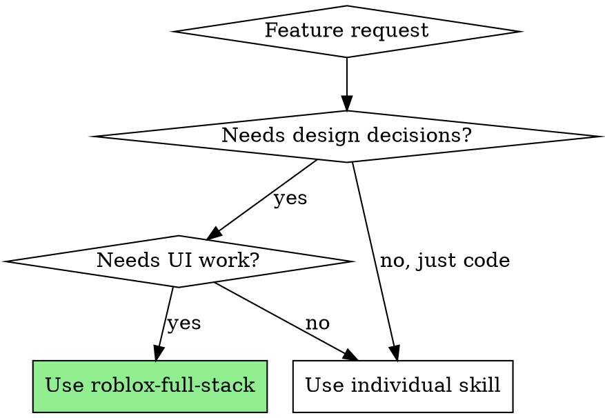
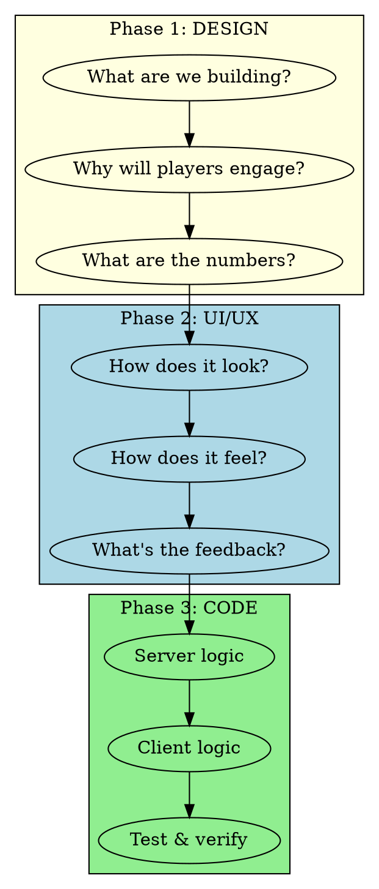

# Roblox Full-Stack Development

## Overview

Orchestrates all three Roblox skills for complete feature development. Use when a feature touches design decisions, UI/UX, AND technical implementation.

**Core principle:** Design first, UI second, code last. Never code without knowing what you're building or how it should feel.

## When to Use



**Use this skill for:**
- "Build the daily rewards system"
- "Implement battle pass"
- "Create the shop"
- "Add 1v1 duels"
- Any feature requiring design + UI + code

**Use individual skills for:**
- Pure design questions → roblox-game-designer
- Pure UI work → roblox-ui-ux
- Pure code/MCP → roblox-studio-expert

## The Three-Phase Workflow



## Phase 1: Design (roblox-game-designer)

**Invoke:** `Skill(skill="roblox-game-designer")`

**Answer these questions:**

| Question | Example (Daily Rewards) |
|----------|------------------------|
| What's the core loop? | Login → Claim → Return tomorrow |
| What's the psychology? | Loss aversion (streak), variable rewards |
| What are the numbers? | Day 1: 50 currency, Day 7: rare item |
| What's the monetization angle? | None direct, drives retention |
| What's the FOMO element? | Streak reset on miss |

**Deliverable:** Clear spec with progression curves, reward tables, psychology hooks.

## Phase 2: UI/UX (roblox-ui-ux)

**Invoke:** `Skill(skill="roblox-ui-ux")`

**Answer these questions:**

| Question | Example (Daily Rewards) |
|----------|------------------------|
| What's the layout? | Modal popup, calendar grid |
| What's the visual hierarchy? | Today highlighted, claimed days glow |
| What's the feedback? | Claim button pulses, reward flies to inventory |
| What's the animation? | Popup slides in, confetti on day 7 |
| Mobile considerations? | Touch-friendly claim button, readable grid |

**Deliverable:** UI component list, layout specs, animation descriptions.

## Phase 3: Code (roblox-studio-expert)

**Invoke:** `Skill(skill="roblox-studio-expert")`

**Build in this order:**

1. **Server logic first**
   - DataStore schema for streak/claims
   - Validation logic (can player claim today?)
   - Reward granting

2. **RemoteEvents**
   - `DailyRewardClaim` (client → server)
   - `DailyRewardResult` (server → client)

3. **Client UI**
   - ScreenGui structure
   - Calendar rendering
   - Claim button handler

4. **Polish**
   - Animations
   - Sound effects
   - Error handling

**Deliverable:** Working, tested code in Studio.

## Feature Checklist Template

Copy this for each feature:

```markdown
## Feature: [Name]

### Phase 1: Design
- [ ] Core loop defined
- [ ] Psychology hooks identified
- [ ] Numbers/curves specified
- [ ] Monetization impact assessed

### Phase 2: UI/UX
- [ ] Layout designed
- [ ] Components listed
- [ ] Animations specified
- [ ] Mobile considered
- [ ] Feedback defined

### Phase 3: Code
- [ ] Server script created
- [ ] DataStore schema defined
- [ ] RemoteEvents created
- [ ] Client script created
- [ ] UI built
- [ ] Playtest passed
- [ ] Error handling added
```

## Example: Building Daily Rewards

### Step 1: Design Phase
```
Invoke: Skill(skill="roblox-game-designer")

Design decisions:
- 7-day cycle with escalating rewards
- Streak resets on miss (loss aversion)
- Day 7 = mystery chest (variable reward)
- +25% bonus after completing cycle (retention hook)
```

### Step 2: UI Phase
```
Invoke: Skill(skill="roblox-ui-ux")

UI spec:
- Modal popup on login (if unclaimed)
- 7-cell calendar grid
- Claimed days: checkmark + glow
- Today: pulsing highlight
- Claim button: large, centered, animated
- Reward preview: icon + amount
- Streak counter: "Day X of 7"
```

### Step 3: Code Phase
```
Invoke: Skill(skill="roblox-studio-expert")

Implementation:
1. DailyRewardManager.server.luau
   - Load player's LastLoginDate, DailyStreak from DataStore
   - Calculate if claim is valid
   - Grant reward, update streak

2. Remotes: DailyRewardClaim, DailyRewardResult

3. DailyRewardGui in StarterGui
   - Calendar grid with UIGridLayout
   - Claim button with feedback

4. UIController handles showing/hiding popup
```

## Anti-Patterns

| Don't | Why | Do Instead |
|-------|-----|------------|
| Code before design | You'll rebuild when requirements change | Spec the numbers first |
| Skip UI planning | "Functional" UI feels bad | Design the feel, then build |
| Build client-first | Security holes, rework | Server logic first, always |
| Skip playtesting | Bugs ship | Test after every major piece |
| Do all phases at once | Context overload | Complete each phase before next |

## Quick Invocation

For rapid full-stack work, invoke all three at session start:

```
I'm building [feature]. Loading all Roblox skills:
- Skill(skill="roblox-game-designer") for design
- Skill(skill="roblox-ui-ux") for UI
- Skill(skill="roblox-studio-expert") for code
```

Or just invoke this skill - it provides the workflow and you can drill into specific skills as needed.

## Skill Reference

| Skill | Focus | When to Drill In |
|-------|-------|------------------|
| roblox-game-designer | Progression, monetization, psychology | Tuning numbers, adding engagement hooks |
| roblox-ui-ux | GUI components, layouts, feedback | Building screens, animations, polish |
| roblox-studio-expert | MCP tools, Luau, architecture | Writing code, debugging, playtesting |
