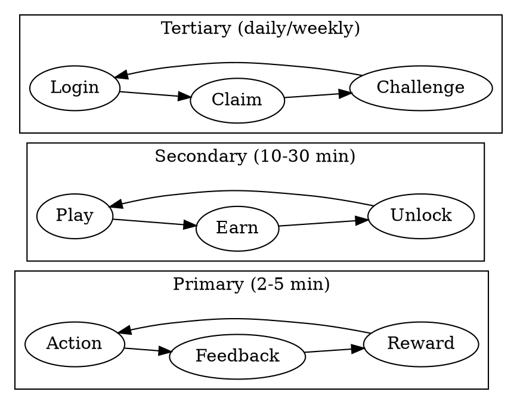

# Roblox Game Designer

## Overview

Design systems that maximize player retention and monetization while maintaining fair, enjoyable gameplay. Focus on psychological engagement loops, not exploitative mechanics.

**Core principle:** Cosmetic-only monetization. Engagement through mastery and collection, never pay-to-win.

## When to Use

**Use for:**
- Designing progression systems (XP, levels, prestige)
- Monetization strategy (Game Passes, Developer Products, pricing)
- Engagement loops (daily rewards, challenges, streaks)
- Retention mechanics (FOMO, loss aversion, sunk cost)
- Content roadmaps (seasonal events, battle passes)
- Roblox algorithm optimization

**Skip for:** Technical implementation (use roblox-studio-expert), UI layouts (use roblox-ui-ux)

## Core Loop Design



### Primary Loop (per-round)
Action → Feedback → Score → Micro-reward → Repeat

**Key elements:**
- Immediate feedback (< 100ms response)
- Variable ratio reinforcement (occasional bonus)
- Near-miss psychology (show how close they were)
- Flow state maintenance (escalating difficulty)

### Secondary Loop (per-session)
Play rounds → Earn XP/currency → Level up → Unlock → Play more

**Key elements:**
- Visible progression bar always on screen
- "Almost there" indicators near thresholds
- End-of-session summary with next goals
- No natural stopping points

### Tertiary Loop (daily/weekly)
Login → Claim rewards → Complete challenges → Return

**Key elements:**
- Streak-based daily rewards (escalating, reset on miss)
- Weekly challenges requiring multiple sessions
- Limited-time events creating urgency

## Progression Systems

### XP Curve Formula

```
XP_required(level) = floor(100 * level ^ 1.5)
```

| Level | XP to Next | Cumulative | Design Intent |
|-------|------------|------------|---------------|
| 1→2 | 100 | 100 | Instant gratification |
| 5→6 | 559 | 1,854 | First session complete |
| 10→11 | 1,000 | 5,873 | Hooked player |
| 25→26 | 3,125 | 32,183 | Committed player |
| 50→51 | 8,839 | 115,789 | Dedicated player |
| 100 | MAX | ~400,000 | Prestige unlock |

**Design notes:**
- Early levels FAST (multiple per first session)
- Mid levels maintain momentum
- High levels are achievement markers
- Prestige resets with cosmetic badge (10 prestiges max)

### Skill Rankings

| Rank | Points | % of Players | Decay |
|------|--------|--------------|-------|
| Bronze | 0-999 | 40% | None |
| Silver | 1000-2499 | 30% | -5/day |
| Gold | 2500-4999 | 20% | -10/day |
| Diamond | 5000-9999 | 8% | -15/day |
| Legend | 10000+ | 2% | -20/day |

**Point changes:**
- Win: +25 (+10 bonus vs higher rank)
- Loss: -15 (-5 reduction vs lower rank)
- Decay only activates after 24h inactivity
- Can't decay below rank floor

### Battle Pass Structure

| Parameter | Value | Rationale |
|-----------|-------|-----------|
| Season length | 30 days | Monthly cycle, predictable |
| Total tiers | 40 | ~1 tier/day + buffer |
| XP per tier | 1000 (scaling) | Achievable with daily play |
| Premium price | 399 Robux | Below $5 psychological barrier |
| Free:Premium ratio | 1:1 every tier | Free players see value |

**Tier reward distribution:**
- Tiers 1-10: Currency, common items (quick wins)
- Tiers 11-20: Uncommon items, small XP boosts
- Tiers 21-30: Rare items, significant rewards
- Tiers 31-39: Epic items, exclusive content
- Tier 40: Season-exclusive legendary (FOMO anchor)

## Monetization Strategy

### Pricing Psychology

| Price Point | Perception | Use For |
|-------------|------------|---------|
| 49-75 R | Impulse buy | Common trails, small currency |
| 99-149 R | Considered | Uncommon items |
| 199-299 R | Investment | Game passes, rare items |
| 399-499 R | Commitment | Battle pass, epic items |
| 799+ R | Whale tier | Legendary exclusives |

### Game Passes (One-Time)

| Pass | Price | Value Prop |
|------|-------|------------|
| VIP | 299 R | 2x XP, chat tag, exclusive range |
| Double Currency | 149 R | 2x currency forever |
| Radio | 99 R | Social expression |

**Design rules:**
- Never gameplay advantages
- Clear, permanent value
- Status symbols matter

### Developer Products (Repeatable)

**Cosmetics by rarity:**
- Common: 49-75 R
- Uncommon: 75-99 R
- Rare: 149-199 R
- Epic: 299-399 R
- Legendary: 499-799 R

**Currency packs:**
| Pack | Price | Amount | Bonus |
|------|-------|--------|-------|
| Starter | 75 R | 500 | — |
| Value | 199 R | 1500 | +10% |
| Premium | 399 R | 3500 | +20% |

## Engagement Psychology

### Daily Rewards Calendar

| Day | Reward | Psychology |
|-----|--------|------------|
| 1 | 50 currency | Low barrier entry |
| 2 | 100 currency | Momentum |
| 3 | Random common | Variable reward |
| 4 | 200 currency | Building |
| 5 | Random uncommon | Excitement spike |
| 6 | 500 currency | High value |
| 7 | Mystery chest (rare) | Weekly payoff |

**After day 7:** Cycle repeats with +25% currency bonus (stacks up to 4x)

**Streak rules:**
- Must claim within 24 hours
- Miss = reset to day 1
- Visual: Calendar with glow on claimed days

### FOMO Event Calendar

| Event | Duration | Frequency | Hook |
|-------|----------|-----------|------|
| Weekend Warrior | Fri-Sun | Weekly | 2x XP |
| Lucky Hour | 2 hours | 2-3x/week | 3x rare drops |
| Tournament | Sat-Sun | Monthly | Exclusive titles |
| Seasonal | 2 weeks | Quarterly | Limited items |
| Anniversary | 1 week | Yearly | Legacy content |

### Loss Aversion Tactics

| Mechanic | Implementation |
|----------|----------------|
| Streak counter | Prominent display, "X days!" celebration |
| Rank decay | Gentle (-10/day), never lose items |
| Season end | Countdown timer, "Complete now!" |
| Limited stock | "Only X remaining" (artificial scarcity) |

### Variable Reward Schedule

Random elements that create excitement:
- Rare drops after matches (1-5% chance)
- Lucky shot bonus targets (random spawn)
- Critical hit multiplier on perfect accuracy
- Mystery chests at XP milestones

**Never:** Loot boxes for purchase. Randomized rewards are earn-only.

## First-Time User Experience (FTUE)

| Timing | Event | Goal |
|--------|-------|------|
| 0-30s | Tutorial bullseye | Competence feeling |
| 30-60s | Free cosmetic gift | Endowment effect |
| 60-90s | First full round | Core loop |
| Post-round | Level up + reward | Dopamine hit |
| 2 min | "Next unlock in X" | Future hook |

**FTUE rules:**
- Player succeeds within 30 seconds (no early failure)
- Free item creates ownership feeling
- Show other players' cool items (aspiration)
- Always end on positive progression

## Roblox Algorithm Optimization

Design for discovery signals:

| Signal | Design Decision |
|--------|-----------------|
| Play Time | No stopping points, always next goal |
| Return Visits | Daily rewards, weekly challenges |
| Social Invites | Both players get 200 currency |
| Thumbs Up | Prompt after successful rounds |
| Premium Playtime | VIP benefits, premium-friendly prices |

### Prompt Timing

**Ask for thumbs up when:**
- Player just hit 3+ bullseyes
- Player just leveled up
- Player just won a duel

**Never ask when:**
- Player is frustrated
- Immediately on join
- During gameplay

## Content Roadmap Template

### MVP (Weeks 1-4)
- Core mechanic
- 1 arena
- XP/levels
- Daily rewards
- Basic leaderboard

### Post-MVP (Months 2-3)
- Battle pass
- Shop with 5-10 items
- Weekly challenges
- Second arena
- 1v1 duels

### Growth (Months 4-6)
- Tournaments
- Clans
- Mastery tracks
- Seasonal events
- 10+ cosmetics

## Anti-Patterns

| Don't | Why |
|-------|-----|
| Pay-to-win | Destroys competitive integrity, backlash |
| Loot boxes for Robux | Gambling mechanics, regulatory risk |
| Aggressive popups | Annoys players, increases churn |
| Impossible challenges | Frustration, not engagement |
| Too much content at once | Overwhelms, dilutes value |

## Quick Design Checklist

When designing any new system:

- [ ] Does it respect players' time?
- [ ] Is it achievable for free players?
- [ ] Does premium accelerate, not gate?
- [ ] Is the value proposition clear?
- [ ] Does it create positive emotion?
- [ ] Does it encourage return visits?
- [ ] Does it avoid dark patterns?
