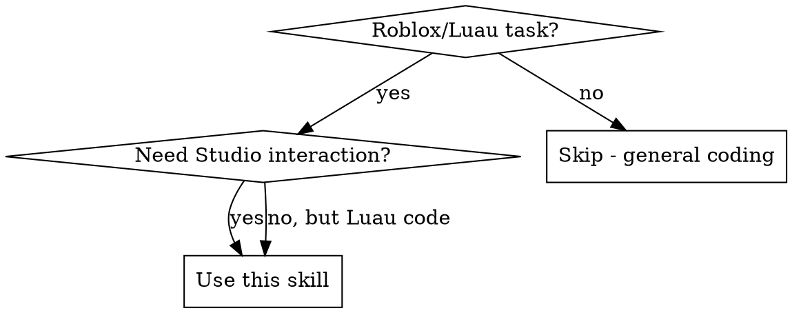
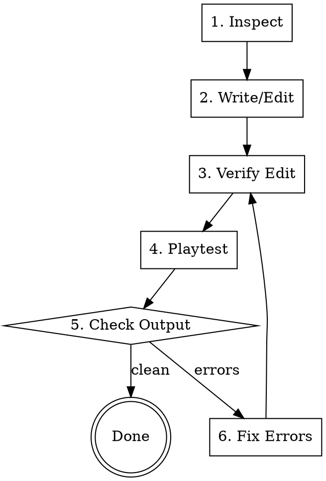

# Roblox Studio Expert

## Overview

Expert-level Roblox development via direct MCP connection to Studio. This skill covers the complete workflow: inspecting hierarchy, writing Luau scripts, creating instances, procedural builds, playtesting, and debugging.

**Core principle:** Server authoritative, client predictive. Never trust client input.

## When to Use



**Use for:**
- Writing/editing Luau scripts (server, client, module)
- Creating/modifying Roblox instances via MCP
- Procedural build generation
- Playtest → debug → fix loops
- DataStore/persistence logic
- RemoteEvent/RemoteFunction architecture
- Hit detection, physics, scoring systems

**Skip for:** Non-Roblox code, general game design discussion

## MCP Tool Categories

### Inspection (Read-Only)

| Tool | Purpose | Example Use |
|------|---------|-------------|
| `get_project_structure` | Full hierarchy tree | Understand codebase layout |
| `get_script_source` | Read script code | Review before editing |
| `grep_scripts` | Search all scripts | Find function usages |
| `get_instance_properties` | Get all props | Check configuration |
| `get_instance_children` | List children | Navigate hierarchy |
| `search_objects` | Find by name/class | Locate specific instances |
| `get_services` | List services | Check available services |
| `get_selection` | Current selection | Context for operations |

### Modification (Write)

| Tool | Purpose | Example Use |
|------|---------|-------------|
| `set_script_source` | Replace entire script | Initial script creation |
| `edit_script_lines` | Replace line range | Targeted fixes |
| `insert_script_lines` | Add lines | Add new functions |
| `delete_script_lines` | Remove lines | Remove dead code |
| `create_object` | Create instance | Add new script/part |
| `delete_object` | Remove instance | Clean up |
| `set_property` | Set single prop | Configure instance |
| `mass_set_property` | Bulk prop changes | Batch updates |

### Procedural Builds

| Tool | Purpose |
|------|---------|
| `generate_build` | JS-based procedural generation |
| `create_build` | Define build from part arrays |
| `import_build` | Place build in Studio |
| `import_scene` | Place multiple builds |
| `list_library` | Browse saved builds |
| `get_build` | Retrieve build for editing |

### Testing

| Tool | Purpose |
|------|---------|
| `start_playtest` | Begin play/run mode |
| `get_playtest_output` | Poll logs (print/warn/error) |
| `stop_playtest` | End playtest, get final output |
| `execute_luau` | Run arbitrary Luau in plugin context |

## Development Workflow



### Step Details

**1. Inspect:** Use `get_project_structure` or `get_script_source` to understand current state before changes.

**2. Write/Edit:** Use `set_script_source` for new scripts, `edit_script_lines` for targeted changes.

**3. Verify:** ALWAYS call `get_script_source` after editing to confirm the change applied correctly.

**4. Playtest:** Use `start_playtest` with mode "play" (full client) or "run" (server only).

**5. Check Output:** Poll `get_playtest_output` for errors. Look for:
- Luau syntax errors
- nil reference errors
- Remote communication failures
- DataStore errors

**6. Fix:** Edit the problematic lines, re-verify, re-test. Don't move on with broken code.

## Luau Conventions

### Script Types

| Suffix | Location | Runs On |
|--------|----------|---------|
| `.server.luau` | ServerScriptService | Server |
| `.client.luau` | StarterPlayerScripts | Client |
| `.luau` (module) | ReplicatedStorage/Modules | Both (when required) |

### Type Annotations

```lua
-- Function signatures
function calculateScore(hits: number, difficulty: string): number
    return hits * getDifficultyMultiplier(difficulty)
end

-- Type definitions (in Types.luau module)
export type PlayerData = {
    Level: number,
    XP: number,
    Currency: number,
    Inventory: {Bows: {string}, Trails: {string}}
}
```

### Modern Task API

```lua
-- GOOD: Modern API
task.spawn(function() ... end)
task.wait(1)
task.delay(5, function() ... end)

-- BAD: Deprecated
spawn(function() ... end)  -- Don't use
wait(1)                    -- Don't use
delay(5, function() ... end)  -- Don't use
```

### Error Handling

```lua
-- Always wrap DataStore/HTTP calls
local success, result = pcall(function()
    return DataStore:GetAsync(key)
end)

if not success then
    warn("DataStore error:", result)
    return defaultValue
end
return result
```

## Client-Server Security

### The Golden Rule

**Server calculates. Client requests and displays.**

```lua
-- CLIENT: Send intent only
-- BowController.client.luau
local function onFireArrow()
    local direction = aimDirection
    local power = drawPower
    FireArrowRemote:FireServer(direction, power)
end

-- SERVER: Validate, calculate, respond
-- GameManager.server.luau
FireArrowRemote.OnServerEvent:Connect(function(player, direction, power)
    -- Validate inputs
    if typeof(direction) ~= "Vector3" then return end
    if typeof(power) ~= "number" then return end
    power = math.clamp(power, 0, 1)  -- Sanitize

    -- Server calculates hit
    local hitResult = calculateHit(player, direction, power)

    -- Server awards points
    awardScore(player, hitResult.score)

    -- Notify client
    ArrowResultRemote:FireClient(player, hitResult)
end)
```

### Rate Limiting

```lua
local lastFire = {}
local FIRE_COOLDOWN = 0.5

FireArrowRemote.OnServerEvent:Connect(function(player, ...)
    local now = tick()
    if lastFire[player.UserId] and now - lastFire[player.UserId] < FIRE_COOLDOWN then
        return  -- Ignore rapid fires
    end
    lastFire[player.UserId] = now
    -- Process...
end)
```

### Never Trust

```lua
-- BAD: Client sends score
ScoreRemote.OnServerEvent:Connect(function(player, score)
    playerData[player].Score = score  -- EXPLOITABLE
end)

-- GOOD: Server calculates score
HitRemote.OnServerEvent:Connect(function(player, targetId)
    local target = Workspace.Targets:FindFirstChild(targetId)
    if not target then return end

    -- Server verifies hit is possible
    local distance = (player.Character.HumanoidRootPart.Position - target.Position).Magnitude
    if distance > MAX_HIT_DISTANCE then return end

    -- Server awards score
    local score = calculateZoneScore(target, hitPosition)
    playerData[player].Score += score
end)
```

## RemoteEvent Patterns

### Folder Structure

```
ReplicatedStorage/
└── Remotes/
    ├── FireArrow (RemoteEvent)
    ├── ArrowResult (RemoteEvent)
    ├── RoundEnd (RemoteEvent)
    └── GetPlayerData (RemoteFunction)
```

### Getting Remotes

```lua
-- Module pattern (recommended)
-- ReplicatedStorage/Modules/Remotes.luau
local ReplicatedStorage = game:GetService("ReplicatedStorage")
local RemotesFolder = ReplicatedStorage:WaitForChild("Remotes")

return {
    FireArrow = RemotesFolder:WaitForChild("FireArrow"),
    ArrowResult = RemotesFolder:WaitForChild("ArrowResult"),
    RoundEnd = RemotesFolder:WaitForChild("RoundEnd"),
    GetPlayerData = RemotesFolder:WaitForChild("GetPlayerData"),
}
```

### RemoteFunction Caution

```lua
-- RemoteFunctions that call CLIENT are dangerous
-- Client can hang forever, crashing the server thread

-- BAD: Server invokes client
local result = SomeRemote:InvokeClient(player, data)  -- Can hang!

-- GOOD: Use RemoteEvent with callback pattern
RequestDataRemote:FireClient(player, requestId)
ResponseRemote.OnServerEvent:Connect(function(player, requestId, data)
    -- Handle response with timeout logic
end)
```

## DataStore Patterns

### Basic Save/Load

```lua
local DataStoreService = game:GetService("DataStoreService")
local PlayerDataStore = DataStoreService:GetDataStore("PlayerData_v1")

local function loadPlayerData(player: Player): PlayerData
    local key = "Player_" .. player.UserId
    local success, data = pcall(function()
        return PlayerDataStore:GetAsync(key)
    end)

    if success and data then
        return data
    end

    -- Return default data for new players
    return {
        Level = 1,
        XP = 0,
        Currency = 0,
        Inventory = {Bows = {"default"}, Trails = {}}
    }
end

local function savePlayerData(player: Player, data: PlayerData)
    local key = "Player_" .. player.UserId
    local success, err = pcall(function()
        PlayerDataStore:SetAsync(key, data)
    end)

    if not success then
        warn("Failed to save data for", player.Name, ":", err)
    end
end
```

### Auto-Save Pattern

```lua
local AUTOSAVE_INTERVAL = 60  -- seconds
local playerData = {}

-- Save on leave
game.Players.PlayerRemoving:Connect(function(player)
    if playerData[player.UserId] then
        savePlayerData(player, playerData[player.UserId])
        playerData[player.UserId] = nil
    end
end)

-- Periodic autosave
task.spawn(function()
    while true do
        task.wait(AUTOSAVE_INTERVAL)
        for userId, data in pairs(playerData) do
            local player = game.Players:GetPlayerByUserId(userId)
            if player then
                savePlayerData(player, data)
            end
        end
    end
end)

-- Save on shutdown
game:BindToClose(function()
    for userId, data in pairs(playerData) do
        local player = game.Players:GetPlayerByUserId(userId)
        if player then
            savePlayerData(player, data)
        end
    end
end)
```

## Procedural Build System

### generate_build Primitives

**High-level (prefer these):**
- `room(x,y,z, w,h,d, wallKey, floorKey?, ceilKey?)` - Complete room
- `roof(x,y,z, w,d, style, key)` - "flat"|"gable"|"hip"
- `stairs(x1,y1,z1, x2,y2,z2, width, key)` - Auto-steps
- `column(x,y,z, height, radius, key)` - With capital
- `arch(x,y,z, w,h, thickness, key)` - Curved archway
- `fence(x1,z1, x2,z2, y, key)` - Posts + rails

**Basic:**
- `part(x,y,z, sx,sy,sz, key, shape?, transparency?)`
- `wall(x1,z1, x2,z2, height, thickness, key)`
- `floor(x1,z1, x2,z2, y, thickness, key)`
- `fill(x1,y1,z1, x2,y2,z2, key)`
- `beam(x1,y1,z1, x2,y2,z2, thickness, key)`

**Repetition:**
- `row(x,y,z, count, spacingX, spacingZ, fn(i,cx,cy,cz))`
- `grid(x,y,z, countX, countZ, spacingX, spacingZ, fn)`

### Example Build

```javascript
// Palette: short keys map to [BrickColor, Material]
palette = {
    "s": ["Dark stone grey", "Cobblestone"],
    "w": ["Brown", "WoodPlanks"],
    "r": ["Maroon", "Slate"]
}

// Build code
room(0,0,0, 10,4,8, "s", "s", "s")  // Stone room
roof(0,4,0, 10,8, "gable", "r")     // Gabled roof
part(0,2,-4, 2,3,0.2, "w", "Block", 0.3)  // Window
row(-3,0,0, 3, 2, 0, (i,x,y,z) => {
    column(x,0,3, 3, 0.3, "s")      // Columns
})
```

## Common Errors & Fixes

| Error | Cause | Fix |
|-------|-------|-----|
| `attempt to index nil` | Missing WaitForChild | Add `:WaitForChild()` for replicated content |
| `ServerScriptService is not a valid member` | Client accessing server | Check script location/type |
| `Event invoked from wrong context` | Client/server mismatch | FireServer from client, FireClient from server |
| `Request was throttled` | DataStore rate limit | Add debounce, batch operations |
| `transform is not a valid member` | Wrong property name | Use CFrame not transform |
| `Players.X.Character is nil` | Character not loaded | Use CharacterAdded event or check |

## Quick Reference

### Services

```lua
local Players = game:GetService("Players")
local ReplicatedStorage = game:GetService("ReplicatedStorage")
local ServerScriptService = game:GetService("ServerScriptService")
local DataStoreService = game:GetService("DataStoreService")
local MarketplaceService = game:GetService("MarketplaceService")
local RunService = game:GetService("RunService")
local TweenService = game:GetService("TweenService")
local UserInputService = game:GetService("UserInputService")
```

### Common Operations

```lua
-- Find child (errors if not found)
local child = parent:FindFirstChild("Name")

-- Wait for child (yields until found)
local child = parent:WaitForChild("Name", 5)  -- 5 sec timeout

-- Get all children of class
for _, part in ipairs(workspace:GetDescendants()) do
    if part:IsA("BasePart") then
        -- process
    end
end

-- Clone and parent
local clone = template:Clone()
clone.Parent = targetFolder

-- Destroy
instance:Destroy()

-- Attribute get/set
local value = instance:GetAttribute("MyAttr")
instance:SetAttribute("MyAttr", newValue)
```

### Vector Math

```lua
-- Distance
local dist = (posA - posB).Magnitude

-- Direction
local dir = (target - origin).Unit

-- Lerp
local mid = posA:Lerp(posB, 0.5)

-- Look at
local cf = CFrame.lookAt(origin, target)
```

## Testing Checklist

Before marking any script task complete:

1. [ ] `get_script_source` confirms edit applied
2. [ ] `start_playtest` runs without syntax errors
3. [ ] `get_playtest_output` shows no runtime errors
4. [ ] Feature works as intended (manual or automated check)
5. [ ] `stop_playtest` cleanly

Never proceed to next task with broken/erroring code.
